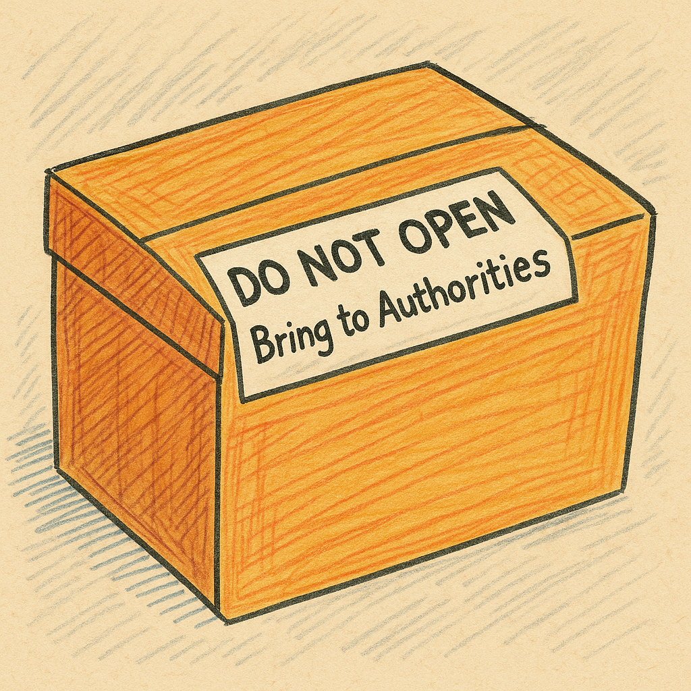

This is private book, you cannot use this without copyright approval

<h1> Man & the Blackhole </h1>

#### Chapter 1: The Box

There was a man whose name was Josh.
He has two children and 1 wife who is named Samantha.
Josh and Samantha were taking a stroll, but then they saw a box in front of them. It had a sign saying `DO NOT OPEN, BRING TO AUTHORITIES IF YOU FIND THIS` but Josh decided to open it anyways without figuring the consequences.

#### Chapter 2: The Thoughts

When Josh opened the box, he was surprised to find out there was another box. Before Josh opened the box Samantha was pushing him not to open the box. Samantha insisted that they should take it to a local fire or police station. Now Samantha was insisting not to open the box inside of it. She thought "What if there's a monster that wants to eat us inside the box?" Josh on the other hand was curious and thought "What if there is some futuristic tech from the year 3000???"  